# Evidence Pack

## 1. Nhóm và track

**Tên nhóm:** `13 Zone C`  
**Track:** Travel & Hospitality  
**Product/app đã chọn:** Chatbot hỏi đáp tiện ích khách sạn dựa trên dữ liệu có cấu trúc của một khách sạn.  
**Build slice đang nghĩ:** Chatbot chỉ trả lời các câu hỏi về thông tin khách sạn, hạng phòng, tiện ích, hình ảnh, mô tả, vị trí và gợi ý tiện ích/xung quanh khách sạn dựa trên dữ liệu đã được cung cấp sẵn.

### Scope của build slice

**Sẽ build trong Day 06:**

- Hỏi đáp thông tin chung của khách sạn:
  - Tên khách sạn.
  - Mô tả ngắn.
  - Địa chỉ / khu vực.
  - Hình ảnh chung.
  - Tiện ích chung: Wi-Fi, hồ bơi, gym, spa, bữa sáng, nhà hàng, bãi đỗ xe, thang máy, lễ tân 24/7, giặt là, đưa đón sân bay nếu có trong data.
- Hỏi đáp từng hạng phòng:
  - Tên phòng / mã phòng.
  - Giá tham khảo nếu data có.
  - Diện tích.
  - Số người tối đa.
  - Loại giường.
  - View.
  - Tiện ích trong phòng.
  - Chính sách phụ thu nếu data có.
  - Ảnh riêng của phòng.
- Hỏi đáp so sánh cơ bản giữa các phòng:
  - “Phòng nào hợp cho 2 người?”
  - “Phòng nào rộng nhất?”
  - “Phòng nào có bồn tắm?”
  - “Phòng nào có ban công/view đẹp?”
  - “Phòng nào dưới 1.500.000đ?”
- Hỏi đáp tiện ích gần khách sạn nếu data có:
  - Địa điểm ăn uống gần khách sạn.
  - Điểm tham quan gần khách sạn.
  - Cửa hàng tiện lợi / ATM / nhà thuốc / bến xe / sân bay gần đó.
  - Chỉ trả lời từ danh sách curated trong Google Sheet/JSON, không tự bịa địa điểm.
- Có fallback an toàn:
  - Không trả lời khi câu hỏi nằm ngoài dữ liệu.
  - Không nhận đặt phòng.
  - Không check phòng trống theo ngày.
  - Không xử lý đổi/trả/hủy phòng.
  - Không báo giá real-time nếu giá không có trong dữ liệu.
  - Không xác nhận chính sách nhạy cảm nếu không có source.

**Sẽ không build trong Day 06:**

- Đặt phòng.
- Hủy phòng.
- Đổi ngày.
- Hoàn tiền.
- Check availability theo ngày.
- Xử lý booking số lượng lớn.
- Thanh toán.
- Tạo voucher/khuyến mãi.
- Tự động nhắn nhân viên.
- Tích hợp PMS/channel manager/OTA.
- Tư vấn itinerary phức tạp theo thời tiết/giờ mở cửa real-time.
- Agent tự hành động thay người dùng.

### Định nghĩa sản phẩm trong 1 câu

Chatbot giúp khách đang tìm hiểu khách sạn hỏi bằng ngôn ngữ tự nhiên và nhận câu trả lời đáng tin cậy về tiện ích, phòng, ảnh, vị trí và thông tin xung quanh khách sạn, nhưng chỉ trong phạm vi dữ liệu khách sạn đã cung cấp.

### Dữ liệu đầu vào dự kiến

Ban đầu dùng **Google Sheet** hoặc **JSON**.

Gợi ý cấu trúc data tối thiểu:

```text
hotel_info
- hotel_name
- short_description
- full_description
- address
- area
- checkin_time
- checkout_time
- general_images
- general_amenities
- hotel_policies_known

room_types
- room_id
- room_name
- room_description
- price_from
- max_guests
- area_m2
- bed_type
- view
- room_amenities
- room_images
- notes

nearby_places
- place_id
- place_name
- category
- distance
- short_description
- suitable_for
- source_note

faq_or_policy
- question
- answer
- category
- source
- confidence
```

### Quyết định AI ban đầu

**Chọn:** LLM feature + RAG/structured retrieval, không phải full Agent.  

**Lý do:**

- Task chính là hỏi đáp trên dữ liệu tĩnh/có cấu trúc.
- Bot không cần tự đặt phòng, gọi API booking, thanh toán, đổi lịch hay xử lý nghiệp vụ real-time.
- Rủi ro lớn nhất không phải “thiếu hành động”, mà là trả lời sai/hallucinate về phòng, giá, tiện ích, chính sách.
- Vì vậy cần retrieval có source, confidence threshold, boundary rõ và fallback tốt hơn là agent tự hành động.

---

## 2. Self-use evidence

Nhóm tự trải nghiệm các app/web đang giải quyết gần giống build slice: trang OTA, app đặt phòng, website chính thức khách sạn và công cụ hỏi đáp du lịch bằng AI. Mục tiêu không phải chứng minh app khác “tệ”, mà là ghi lại **điểm gãy khi khách muốn hỏi thông tin phòng/tiện ích bằng ngôn ngữ tự nhiên**.

### Setup test self-use

**Thời điểm test:** 03/06/2026.  
**Persona test:** Khách Việt đang cân nhắc đặt khách sạn cho chuyến đi ngắn ngày, muốn hiểu rõ phòng và tiện ích trước khi quyết định.  
**Khách sạn mẫu để test:** Meliá Hanoi (Khách sạn 5 sao tại 44B Lý Thường Kiệt, Hoàn Kiếm, Hà Nội, Việt Nam)  
**Nền tảng test:** Booking.com, Agoda, Traveloka, Expedia/ChatGPT nếu truy cập được, Google Maps/Tripadvisor review và website chính thức của khách sạn nếu có.  
**Cách chụp screenshot:** Với mỗi observation, chụp màn hình câu hỏi/luồng tìm kiếm + màn hình nơi app/web trả lời hoặc nơi nhóm phải tự dò thông tin.

### Bộ câu hỏi realtime để nhóm test và chụp màn hình

Nhóm dùng các câu hỏi dưới đây để test trên từng app/web. Nếu app không có ô chat/Q&A, nhóm dùng câu hỏi này như checklist để tự đi tìm thông tin trên trang khách sạn.

```text
Q1. Phòng nào phù hợp cho 2 người, có bồn tắm, diện tích từ 35m2 trở lên, có ảnh phòng rõ không?
Q2. Deluxe Room và Premium Room khác nhau gì về diện tích, giường, view, tiện ích trong phòng?
Q3. Bữa sáng, hồ bơi, gym, spa, bãi xe có miễn phí không? Nếu tính phí thì phí bao nhiêu?
Q4. Ảnh này là ảnh riêng của phòng Deluxe hay chỉ là ảnh chung của khách sạn?
Q5. Khách sạn có cho trẻ em, giường phụ, thú cưng, hút thuốc không? Có phụ thu không?
Q6. Gần khách sạn có quán ăn hoặc điểm đi chơi nào trong 10 phút đi bộ không?
Q7. Ngày 15/06 còn phòng Deluxe không?
Q8. Tôi muốn đặt phòng / hủy phòng / đổi ngày đặt thì làm ở đâu?
```

| Observation | Screenshot/link | Path liên quan | Điều học được |
|---|---|---|---|
| **Traveloka / OTA hotel detail page:** Khi test câu Q3 “Bữa sáng, hồ bơi, gym, spa, bãi xe có miễn phí không?”, thông tin tiện ích có tồn tại nhưng bị rải ở nhiều chỗ: phần facilities, phần FAQ, phần room option, phần điều kiện giá. Có chỗ chỉ ghi “có bữa sáng” hoặc “một số tiện ích có thể tính thêm phí”, nhưng không luôn nói rõ tiện ích nào miễn phí, tiện ích nào trả phí. | 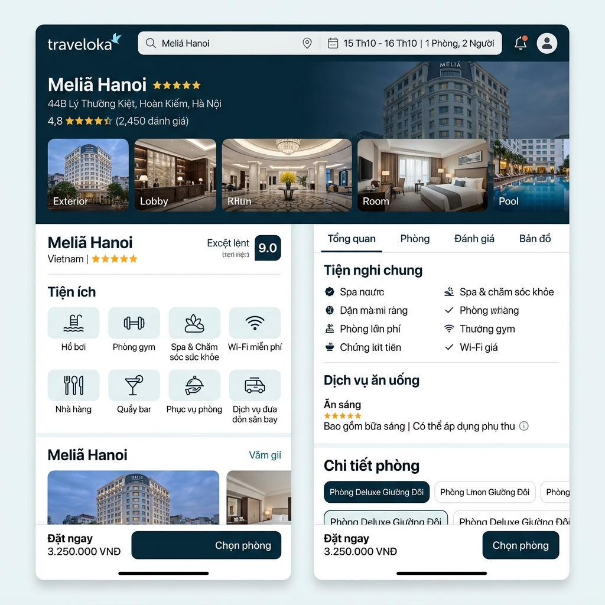 | Low-confidence | Chatbot không nên trả lời kiểu “có bữa sáng / có hồ bơi” là đủ. SPEC cần field rõ: `amenity_name`, `available`, `is_free`, `fee_note`, `applies_to_room`, `source`. Nếu thiếu phí, bot phải nói “chưa có dữ liệu phí”, không được tự đoán. |
| **Agoda / Booking.com room selection:** Khi test câu Q1 “Phòng nào phù hợp cho 2 người, có bồn tắm, diện tích từ 35m2 trở lên, có ảnh phòng rõ không?”, app có bộ lọc và room card nhưng người dùng vẫn phải mở từng hạng phòng, đọc diện tích, tiện ích, ảnh và điều kiện giá. Task này không khó nhưng mất thời gian vì phải ghép nhiều field rời rạc. | 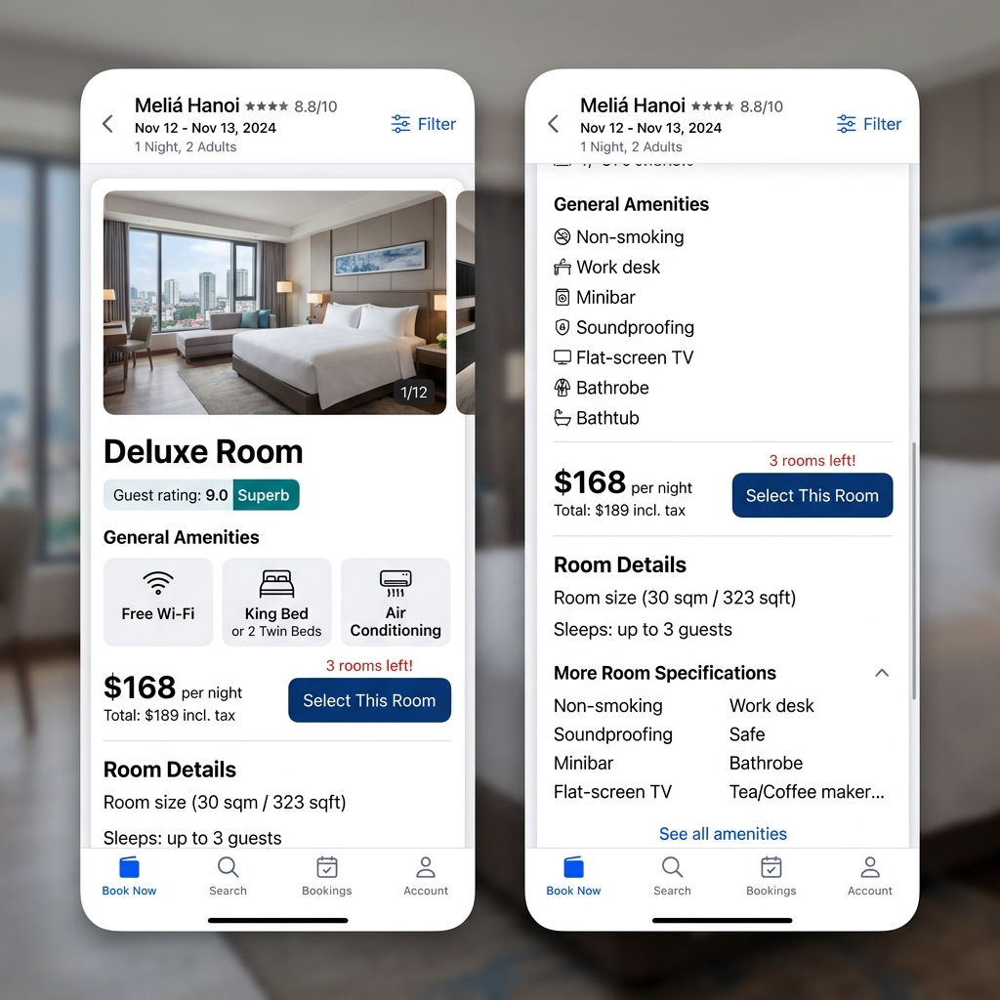 | Happy | Đây là happy path quan trọng nhất của chatbot: biến câu hỏi tự nhiên nhiều điều kiện thành kết quả 1–3 phòng phù hợp, kèm lý do match: sức chứa, diện tích, tiện ích, ảnh, giá tham khảo. |
| **So sánh hạng phòng trên OTA:** Khi test câu Q2 “Deluxe Room và Premium Room khác nhau gì?”, app/web thường hiển thị từng phòng riêng lẻ. Người dùng phải tự so sánh bằng mắt giữa nhiều card: diện tích, view, loại giường, quyền lợi, bữa sáng, ảnh, chính sách hủy. Không có bảng so sánh ngắn gọn theo nhu cầu của khách. | 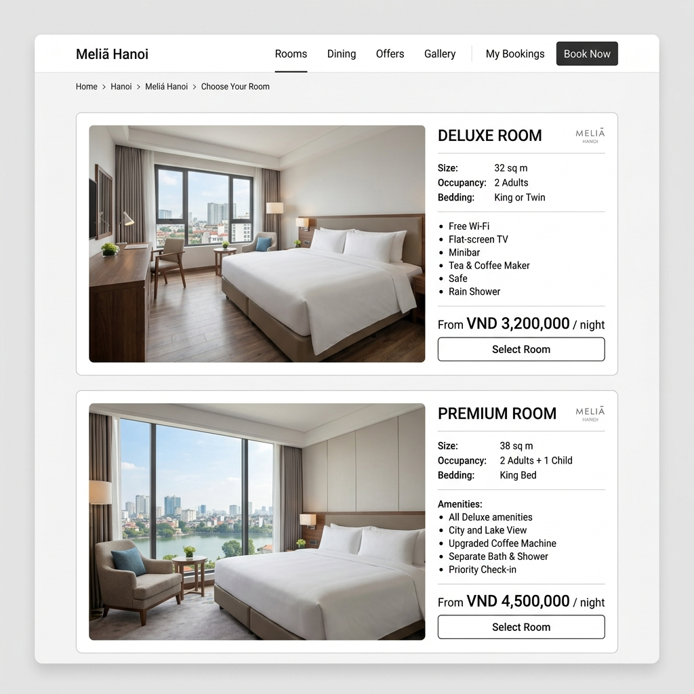 | Happy / Correction | Chatbot nên có path “compare rooms”: trả lời dạng bảng ngắn, chỉ dùng field có trong data. Nếu thiếu field ở một phòng, bot ghi “chưa có dữ liệu”, không tự lấp khoảng trống. |
| **Gallery ảnh phòng trên OTA/website khách sạn:** Khi test câu Q4 “Ảnh này là ảnh riêng của phòng Deluxe hay ảnh chung của khách sạn?”, nhiều trang có gallery rất nhiều ảnh: lobby, nhà hàng, hồ bơi, phòng, bathroom, view. Người dùng dễ nhầm ảnh đẹp trong gallery chung là ảnh của hạng phòng mình định chọn. | 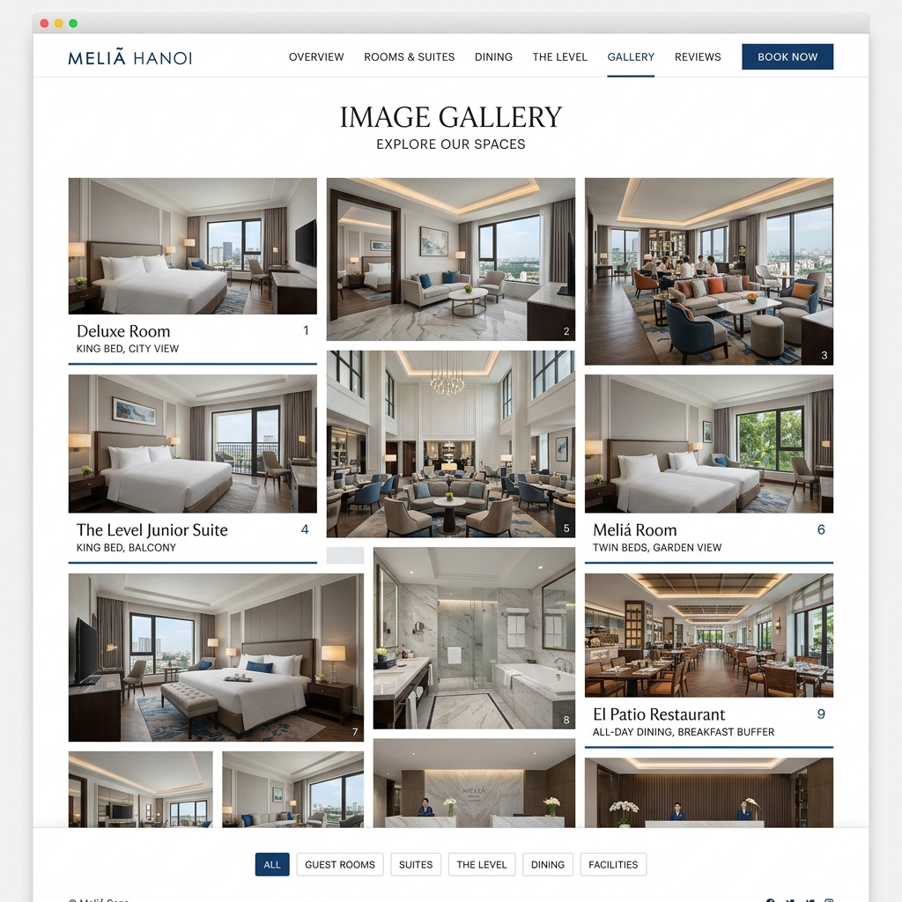 | Low-confidence / Correction | Dữ liệu chatbot phải tách `hotel_images` và `room_images`. Khi gửi ảnh, bot phải nói rõ “ảnh chung khách sạn” hay “ảnh riêng của hạng phòng X”. Không được dùng ảnh chung để đại diện cho một phòng cụ thể. |
| **Website chính thức của khách sạn:** Khi test cùng câu Q3/Q5 trên website chính thức, thông tin thường đáng tin hơn OTA vì là nguồn gốc từ khách sạn, nhưng vẫn cần người dùng tự đọc nhiều mục như FAQ, Services, Rooms, Dining, Policy. Một số thông tin nhạy cảm như phụ thu trẻ em, pet policy, hút thuốc, check-in sớm có thể không nằm ngay trong phần tiện ích. | 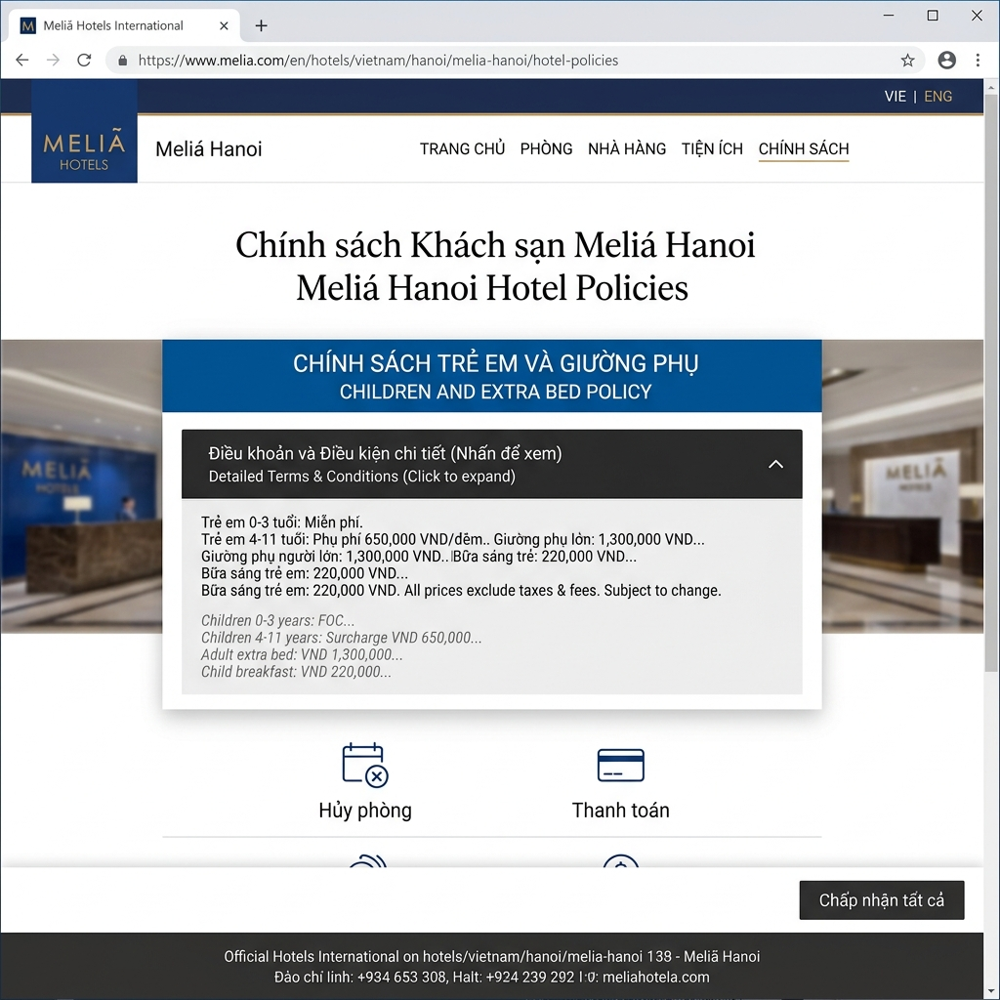 | Correction | Khi nhiều nguồn khác nhau mâu thuẫn, chatbot nên ưu tiên source chính thức của khách sạn. SPEC cần `source_priority`: official hotel data > internal sheet/json > OTA copy > review/social. |
| **Booking.com Property Q&A / AI travel feature nếu truy cập được:** Khi test các câu kiểu Q3/Q5, pattern tốt là cho phép khách hỏi trực tiếp một câu rất cụ thể về property thay vì tự đọc listing. Tuy nhiên nếu tính năng không khả dụng ở tài khoản/quốc gia/thiết bị của nhóm, đó cũng là điểm gãy: không phải khách nào cũng có Q&A/AI ngay trên property page. | 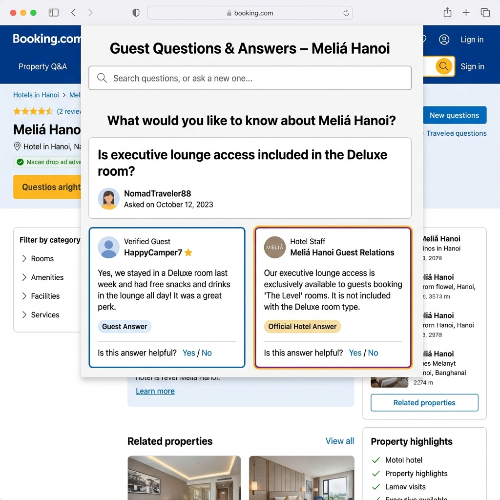 | Happy / Failure | Pattern học được là “Property Q&A” rất đúng với build slice. Nhưng nhóm nên build bản hẹp hơn, kiểm soát hơn: chỉ Q&A trên data khách sạn nhóm cung cấp, có source và fallback rõ, không phụ thuộc feature của OTA. |
| **Expedia in ChatGPT / AI travel planner nếu truy cập được:** Khi test câu hỏi tìm nơi ở hoặc hỏi khách sạn bằng ngôn ngữ tự nhiên, trải nghiệm hội thoại giúp giảm công tìm kiếm. Nhưng bản thân AI travel flow vẫn cần người dùng bấm sang Expedia để kiểm tra/đặt, và các chi tiết quan trọng vẫn phải double-check trước khi booking. | 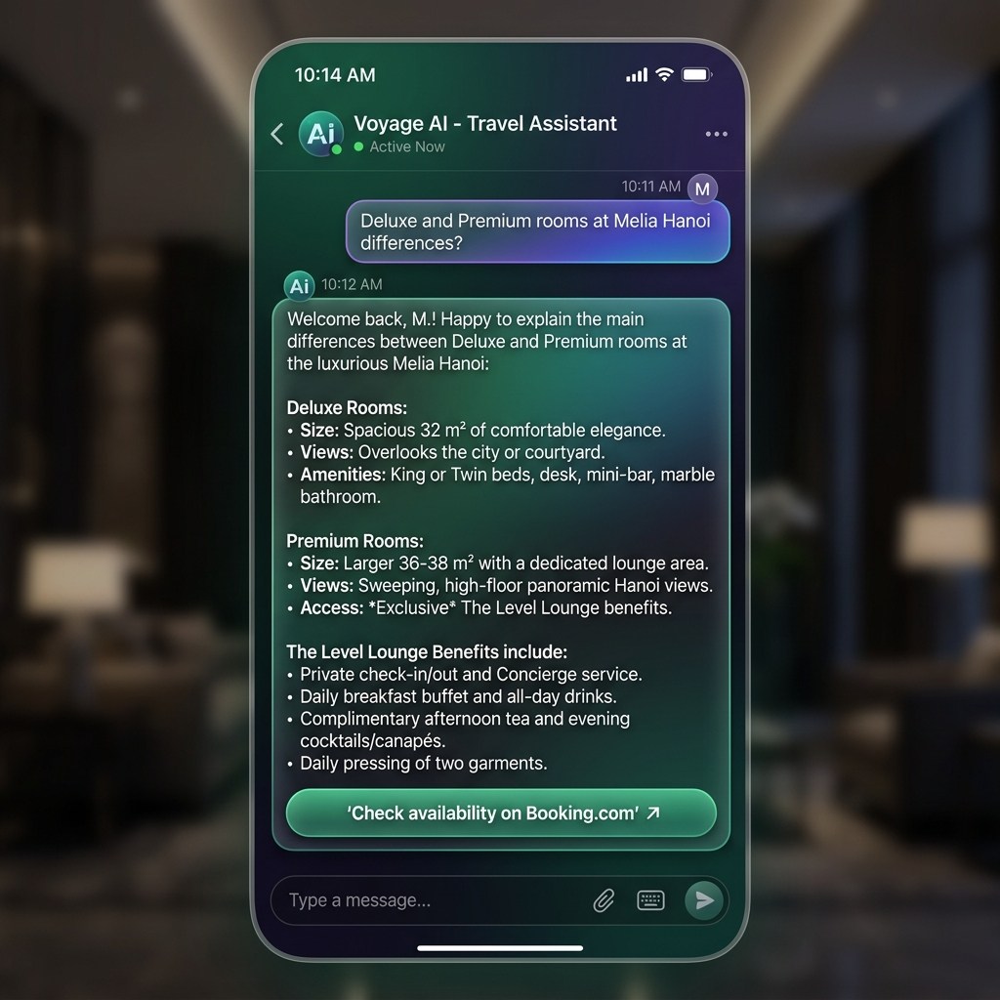 | Low-confidence | AI phù hợp để hỗ trợ khám phá và hỏi đáp, nhưng với thông tin khách sạn phải có cơ chế chống sai: show source, show last updated, không xử lý booking trong chat nếu chưa tích hợp dữ liệu real-time. |
| **Google Maps/Tripadvisor review:** Khi test câu Q6 “Gần khách sạn có quán ăn hoặc điểm đi chơi nào trong 10 phút đi bộ?”, review/map có rất nhiều thông tin địa điểm xung quanh nhưng nhiễu: review cũ, không rõ khoảng cách đi bộ thật, giờ mở cửa có thể đổi, sở thích mỗi người khác nhau. | 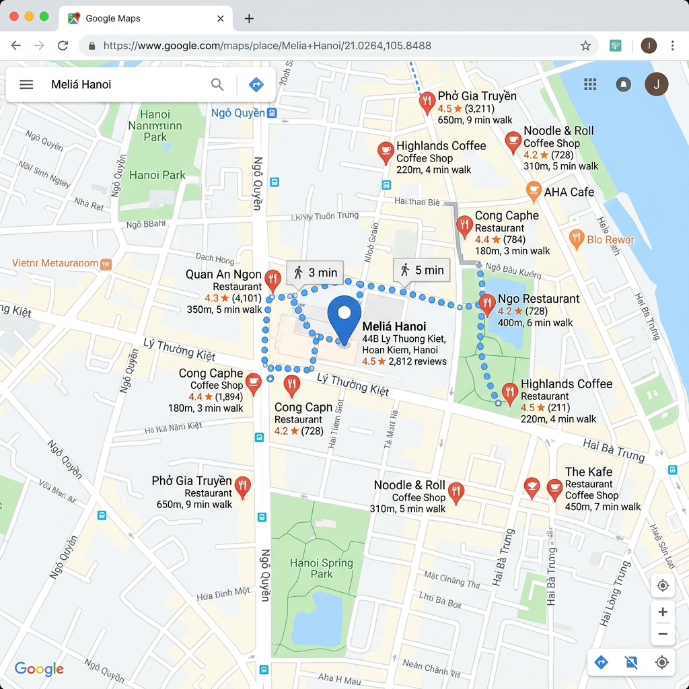 | Low-confidence | Nearby places nên là bảng curated riêng trong data, không để bot tự bịa từ kiến thức chung. Nếu không có giờ mở cửa hoặc khoảng cách đã kiểm chứng, bot phải ghi rõ “chưa có dữ liệu cập nhật”. |
| **Boundary về availability:** Khi test câu Q7 “Ngày 15/06 còn phòng Deluxe không?”, OTA có thể trả lời sau khi người dùng nhập ngày và số khách vì OTA có inventory/price theo thời gian. Build slice của nhóm không có PMS/channel manager/booking API nên không được trả lời còn phòng hay giá real-time. | 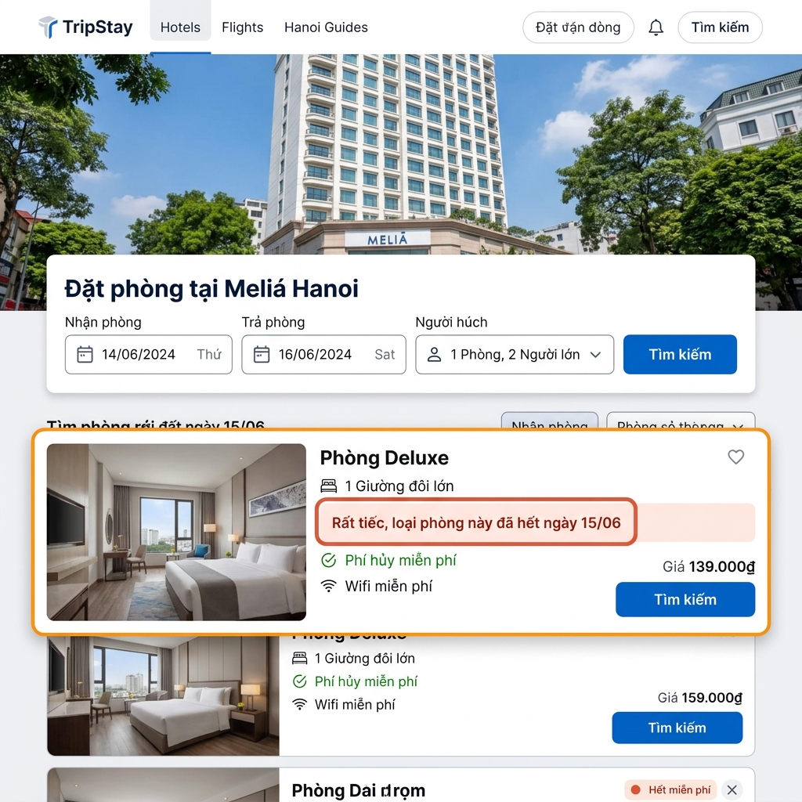 | Failure | Đây là boundary bắt buộc trong SPEC: chatbot không check phòng trống theo ngày, không xác nhận giá real-time. Câu trả lời đúng là hướng người dùng sang booking link/lễ tân để xác nhận availability. |
| **Boundary về booking/change/cancel:** Khi test câu Q8 “Tôi muốn đặt phòng / hủy phòng / đổi ngày”, các app OTA có luồng nghiệp vụ riêng: đăng nhập, chọn booking, điều kiện hủy, thanh toán, chính sách. Đây là task có rủi ro giao dịch và phụ thuộc hệ thống ngoài. | 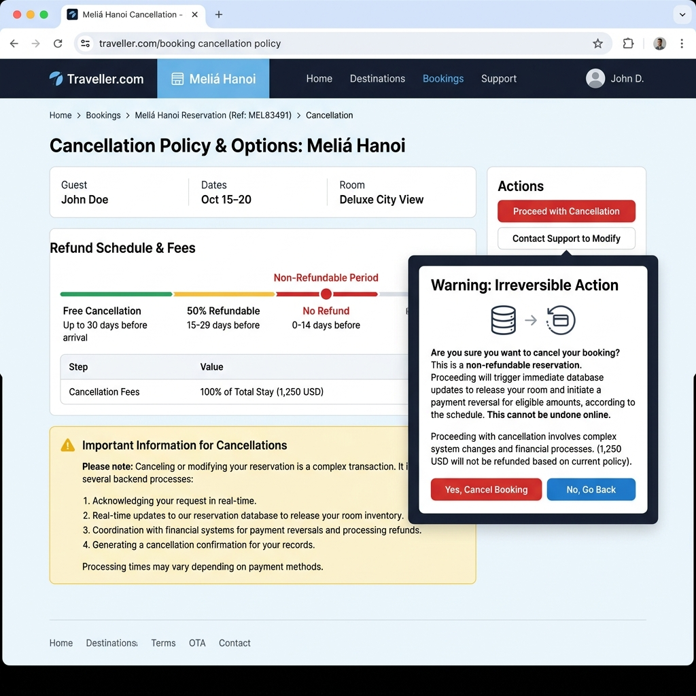 | Failure | Nhóm không nên build booking agent ở M1. Bot chỉ nên nói rõ ngoài scope và hướng dẫn kênh xử lý: “Mình chỉ hỗ trợ hỏi đáp thông tin khách sạn/phòng/tiện ích; để đặt/hủy/đổi ngày, vui lòng dùng link booking hoặc liên hệ lễ tân.” |
| **Câu hỏi tiếng Việt đời thường:** Khi tự test bằng câu viết tắt/sai chính tả như “phong nao cho gdinh 4ng co bep ko”, app/web truyền thống gần như không hỗ trợ vì người dùng phải tự lọc/đọc. Nếu dùng AI, bot hiểu ý tốt hơn nhưng vẫn phải map về field có trong data: số khách tối đa, bếp, tiện ích phòng, phụ thu. | 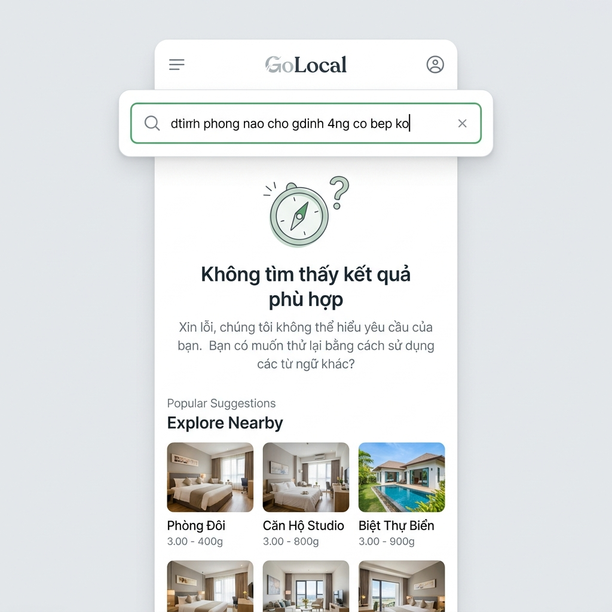 | Happy / Low-confidence | Lợi thế chính của LLM feature là hiểu ngôn ngữ tự nhiên tiếng Việt. Nhưng câu trả lời vẫn phải grounded: nếu data không có field `kitchen` hoặc `max_guests`, bot không được tự suy đoán. |

### Kết luận từ self-use

```text
Điểm gãy quan sát được:
Các app/web OTA và website khách sạn có rất nhiều dữ liệu, nhưng dữ liệu bị phân mảnh: phòng, ảnh, tiện ích, phí, chính sách và địa điểm xung quanh nằm ở nhiều khu vực khác nhau. Người dùng phải tự đọc, tự so sánh và tự suy luận.

Insight cho build slice:
User không chỉ cần “xem thông tin khách sạn”. Họ cần một lớp hỏi đáp đáng tin để ghép đúng thông tin theo nhu cầu cụ thể: phòng nào hợp với tôi, tiện ích nào có thật, cái nào miễn phí/tính phí, ảnh nào thuộc phòng nào, và câu nào phải chuyển sang kênh booking/lễ tân.

Quyết định SPEC sau self-use:
Build slice nên là Hotel Amenities & Room Info Q&A, không phải booking agent. Bot cần làm tốt 4 path:
1. Happy: lọc/so sánh phòng theo nhu cầu tự nhiên.
2. Low-confidence: trả lời có điều kiện khi thiếu phí, giờ mở cửa, source hoặc dữ liệu real-time.
3. Failure: từ chối availability, booking, hủy/đổi, giá real-time.
4. Correction: ghi nhận thiếu field trong data và đề xuất bổ sung vào Google Sheet/JSON.
```


---

## 3. User / review / social evidence

Nguồn có thể là review App Store/Play, group, comment, phỏng vấn nhanh, hoặc nguồn public khác.

| Quote / review / observation | Nguồn | User là ai? | Pain/failure mode |
|---|---|---|---|
| Một nghiên cứu về complaint online của khách ở khách sạn 4 sao tại Hà Nội ghi nhận 12.633 review, trong đó có 358 negative reviews và 532 complaint, tập trung vào các nhóm như phòng, phòng tắm, nhân viên, facilities, bữa sáng, vị trí, reservation và promotion. | “A Review on the Online Complaints of 4-star Hotels in Hanoi”, 2024. Link: https://dialnet.unirioja.es/descarga/articulo/9722463.pdf | Khách đã ở khách sạn 4 sao tại Hà Nội và để lại review trên Booking.com. | Kỳ vọng trước khi ở không khớp trải nghiệm thật. Pain liên quan trực tiếp đến room/facilities/bathroom/location — đúng với slice hỏi đáp tiện ích và thông tin phòng. |
| Nguồn nghiệp vụ lễ tân tại Việt Nam liệt kê các tình huống phàn nàn phổ biến gồm khách không hài lòng về chất lượng phòng thực tế, thiết bị trong phòng, chất lượng dịch vụ và tiện ích bổ sung. | Hoteljob.vn — “5 tình huống phàn nàn của khách trong khách sạn và hướng xử lý cho nhân viên lễ tân”. Link: https://www.hoteljob.vn/tin-tuc/5-tinh-huong-phan-nan-cua-khach-trong-khach-san-va-huong-xu-ly-cho-nhan-vien-le-tan | Nhân viên lễ tân / khách lưu trú gặp vấn đề khi nhận phòng hoặc trong thời gian ở. | Nếu thông tin phòng/tiện ích không rõ từ đầu, khách có thể kỳ vọng sai và dồn áp lực sang lễ tân. Chatbot nên giúp “làm rõ trước”, không chỉ trả lời sau khi khách phàn nàn. |
| Báo cáo/industry article về guest experience cho thấy khách ngày càng muốn giao tiếp qua messaging/automation; bài viết dẫn số liệu 77% guest quan tâm đến automated messaging services. | Altexsoft — “Hotel Guest Experience: The Role of Tech in Modern Hospitality”, 2025. Link: https://www.altexsoft.com/blog/hotel-guest-experience/ | Khách du lịch/khách lưu trú hiện đại, quen nhắn tin thay vì gọi điện/quầy lễ tân. | Nhu cầu không chỉ là “có thông tin”, mà là có câu trả lời tức thì, tự phục vụ, ít friction. |
| Một sự kiện social/news gần đây cho thấy khách có thể thấy bị “misleading” khi amenity trong phòng nhìn giống miễn phí nhưng thực tế bị tính phí; nhiều người dùng TikTok nói họ cũng sẽ hiểu nhầm là miễn phí. | People — “Traveler Slams Hotel as ‘Misleading’ for Charging for Bathroom Amenities That Appear to Be Free at First”, 2026. Link: https://people.com/traveler-slams-misleading-hotel-for-charging-for-bathroom-amenities-11952052 | Khách lưu trú gặp thông tin không rõ về paid/free amenities. | Failure mode: tiện ích không được phân loại rõ “miễn phí / tính phí / không chắc”. SPEC cần field `is_free`, `fee_note`, hoặc fallback nếu chưa có dữ liệu. |
| Các sản phẩm AI travel lớn như Booking.com AI Trip Planner cho phép người dùng hỏi câu hỏi travel tổng quát/cụ thể và refine trong hội thoại. Điều này chứng minh hành vi hỏi bằng ngôn ngữ tự nhiên là hợp lý, nhưng sản phẩm của nhóm cần hẹp hơn và đáng tin hơn trong một khách sạn cụ thể. | Booking.com News — AI-powered travel planning features. Link: https://news.booking.com/bookingcom-enhances-travel-planning-with-new-ai-powered-features--for-easier-smarter-decisions/ | Người đi du lịch ở giai đoạn planning. | Pattern người dùng muốn hỏi tự nhiên, nhưng nếu scope quá rộng sẽ khó kiểm soát hallucination. Slice nên đóng miền: chỉ data khách sạn đã cung cấp. |

---

## 4. Competitor / analog evidence

| App / mô hình tham khảo | Họ xử lý task này thế nào? | Pattern học được | Có áp dụng trong 1 ngày không? |
|---|---|---|---|
| Booking.com AI Trip Planner | Cho phép traveler hỏi câu hỏi chung/cụ thể và refine trong hội thoại để phục vụ travel planning. | Conversational refinement: người dùng không muốn điền form cứng, họ muốn nói nhu cầu tự nhiên rồi chỉnh dần. | Có, nhưng thu hẹp: chỉ refine trong phạm vi 1 khách sạn và room/amenity data, không làm trip planner tổng quát. |
| Expedia in ChatGPT | Tích hợp trải nghiệm hỏi đáp/khám phá du lịch bằng ChatGPT, trả kết quả nhanh, trực quan. | Visual answer matters: với travel/hotel, câu trả lời nên có ảnh, room card, key facts, không chỉ text dài. | Có một phần: trả về room card gồm ảnh, giá, diện tích, sức chứa, tiện ích chính. |
| Marriott Help / Hotel Services & Amenities | Tổ chức self-service help theo nhóm: reservation, hotel services & amenities, dining, accessibility. | Taxonomy rõ giúp bot biết câu nào thuộc scope nào. Dữ liệu nên có category: room, hotel_amenity, policy, nearby_place, out_of_scope. | Có. Dùng taxonomy này để thiết kế intent và fallback trong 1 ngày. |
| Hilton + IBM Connie | Robot concierge hỗ trợ visitor request, cá nhân hóa trải nghiệm và cung cấp thông tin để khách lên kế hoạch trong chuyến đi. | Concierge model phù hợp hospitality, nhưng cần làm cùng nhân viên và có giới hạn. | Có một phần: chatbot đóng vai concierge thông tin, không xử lý request operational như room service/upgrade. |
| Hotel chatbot industry pattern | Nhiều hotel chatbot hướng đến 24/7 support, upsell, direct booking, trả lời amenities, room upgrades, local attractions. | Các sản phẩm lớn thường ôm nhiều thứ: booking, upsell, service request. Với bài lab, nên chọn wedge hẹp để test nhanh: “trusted amenity Q&A”. | Có. Làm bản nhỏ hơn: Q&A + source + fallback + unanswered-question log. |

---

## 5. Evidence -> Insight

```text
Evidence nổi bật nhất:
Các complaint/review khách sạn thường xoay quanh phòng, phòng tắm, facilities, breakfast, location và reservation/promotion. Nguồn nghiệp vụ lễ tân tại Việt Nam cũng cho thấy khách hay phàn nàn khi chất lượng phòng thực tế, thiết bị trong phòng hoặc tiện ích không đúng kỳ vọng. Đồng thời, người dùng du lịch đang quen với messaging/automation và các sản phẩm lớn như Booking.com/Expedia đã đẩy hành vi hỏi đáp du lịch bằng ngôn ngữ tự nhiên.

Insight:
User không chỉ gặp surface problem là “không biết khách sạn có tiện ích gì”.
Thật ra họ cần giảm rủi ro chọn sai phòng/khách sạn bằng câu trả lời đáng tin, có ảnh/source, nói rõ cái gì có, cái gì không có, cái gì miễn phí/tính phí, và cái gì chưa thể xác nhận.

Deeper need:
- Trust: câu trả lời phải grounded vào data khách sạn, không phóng đại.
- Decision support: giúp khách chọn phòng phù hợp theo số người, ngân sách, diện tích, tiện ích.
- Recovery: khi thiếu data hoặc ngoài scope, bot phải nói không biết/chuyển hướng thay vì bịa.
- Speed: khách muốn hỏi nhanh bằng tiếng Việt tự nhiên thay vì đọc nhiều trang hoặc chờ lễ tân.

Opportunity:
AI có thể giúp bằng cách augment/automate một hành động hẹp:
Chuyển câu hỏi tự nhiên của khách thành truy vấn trên dữ liệu phòng/tiện ích, trả lời bằng room/amenity card có source, ảnh và fallback rõ ràng khi câu hỏi nằm ngoài dữ liệu.
```

### Cơ hội sản phẩm cụ thể

```text
Thay vì build “AI hotel concierge” quá rộng, nhóm build “Trusted Hotel Amenities Q&A”.
Điểm khác biệt không phải bot nói hay, mà là:
1. Chỉ trả lời trong phạm vi data khách sạn.
2. Câu trả lời có source/field/ảnh.
3. Tự nhận diện câu hỏi ngoài scope.
4. Log câu hỏi chưa trả lời được để khách sạn bổ sung data.
5. Ưu tiên tiếng Việt tự nhiên, viết tắt, không dấu.
```

---

## 6. Evidence đổi SPEC như thế nào?

- [x] Đổi user chính.
- [x] Đổi pain statement.
- [x] Đổi build slice.
- [x] Đổi Auto/Aug decision.
- [x] Đổi 4 paths.
- [x] Đổi failure mode.
- [x] Đổi owner/test plan.

### 1–2 thay đổi quan trọng

```text
Trước evidence, nhóm định:
Làm chatbot khách sạn khá rộng, có thể hỏi đáp nhiều thứ liên quan đến khách sạn như phòng, tiện ích, đặt phòng, hủy phòng, địa điểm xung quanh, gợi ý ăn chơi.

Sau evidence, nhóm đổi thành:
Chỉ build chatbot hỏi đáp tiện ích/phòng/vị trí/ảnh/thông tin xung quanh dựa trên Google Sheet/JSON của một khách sạn. Không booking, không hủy, không check phòng trống, không báo giá real-time nếu không có data.

Lý do:
Evidence cho thấy pain lớn nằm ở mismatch kỳ vọng và thông tin phòng/facilities không rõ. Nếu bot ôm cả booking/availability, rủi ro sai cao và không thể build chắc trong 1 ngày. Slice hẹp giúp test được trust, retrieval, fallback và giá trị self-service.
```

```text
Trước evidence, nhóm định:
Để AI trả lời tự nhiên như một nhân viên tư vấn khách sạn.

Sau evidence, nhóm đổi thành:
Để AI trả lời như một “source-backed assistant”: câu nào có dữ liệu thì trả lời kèm source/ảnh/field; câu nào thiếu dữ liệu thì nói rõ chưa có thông tin; câu nào ngoài scope thì từ chối nhẹ và gợi ý liên hệ lễ tân/booking link.

Lý do:
Trong hospitality, trả lời sai về phòng, phí, tiện ích, chính sách dễ làm mất trust. Evidence về misleading amenities và complaint phòng/facilities cho thấy sự rõ ràng quan trọng hơn độ trôi chảy.
```

---